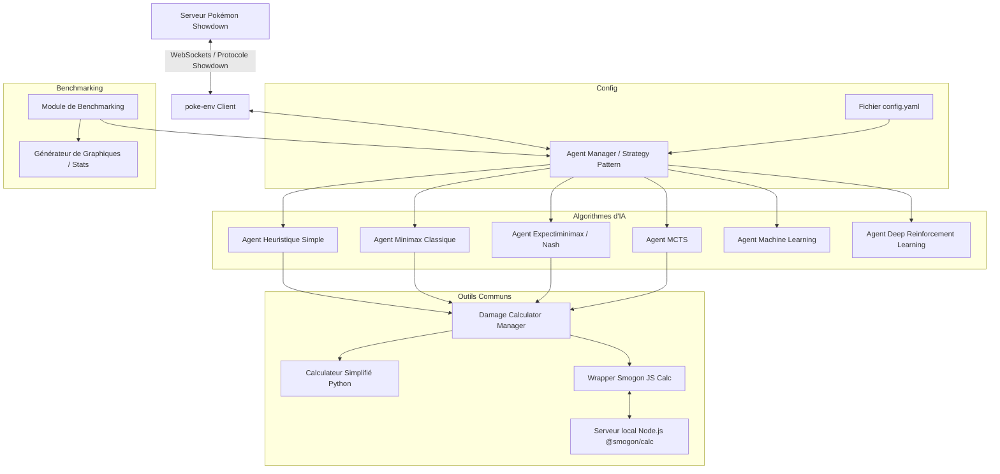

# Cahier des Charges : Bot Pokémon Showdown Intelligent (PokEFREI-Showdown)

Ce document présente les spécifications fonctionnelles et techniques détaillées pour le développement d'un agent de combat autonome et intelligent pour la plateforme Pokémon Showdown.

---

## 1. Présentation du Projet

### 1.1. Contexte et Objectifs
Le projet **PokEFREI-Showdown** consiste à concevoir et réaliser un bot de combat Pokémon en Python capable d'affronter des joueurs humains ou d'autres bots sur Pokémon Showdown. L'objectif principal est de concevoir une architecture logicielle hautement modulaire permettant d'expérimenter, d'évaluer et de comparer plusieurs paradigmes d'Intelligence Artificielle (heuristiques expertes, recherche arborescente planificatrice et apprentissage automatique/profond).

### 1.2. Format de Combat Cible
* **Format principal** : **Gen 9 Random Battle** (`[gen9randombattle]`).
  * *Justification* : Ce format fournit des équipes équilibrées générées aléatoirement à chaque combat avec des ensembles de capacités (movesets), des objets et des répartitions d'effort (EV/IV) standardisés et connus. Cela réduit la complexité liée au "Team Building" tout en conservant une immense richesse tactique.
  * *Évolutivité* : L'architecture devra permettre l'extension vers des formats construits (ex: **Gen 9 OU**) à l'avenir.

---

## 2. Architecture Technique Globale

Le projet sera développé en **Python 3.10+**. L'architecture repose sur la modularité (Strategy Pattern) afin d'assurer l'interopérabilité des différents algorithmes de décision.

### 2.1. Intégration Réseau et Moteur de Jeu
* **Bibliothèque de base** : [poke-env](https://github.com/hsmaitre/poke-env).
  * Elle gère la communication WebSocket avec les serveurs d'épreuve (officiel ou local).
  * Elle parse les messages du protocole Showdown pour maintenir un objet `Battle` représentant l'état courant de la partie.
  * Elle expose une interface propre pour choisir les actions valides (capacités ou switchs).

### 2.2. Configuration et Gestion des Agents (Strategy Pattern)
* Un fichier de configuration centralisé (ex: `config.yaml`) définira l'agent actif, ses paramètres spécifiques (profondeur de recherche, poids des heuristiques, chemins des modèles de réseaux de neurones, etc.).
* La classe abstraite `BaseAgent` étendra `Player` de `poke-env` et imposera la méthode `choose_move(battle)`.

---

## 3. Spécifications des Algorithmes d'IA

Le bot devra supporter et implémenter les agents suivants :

### 3.1. Agent 0 : Heuristique Simple (Baseline)
* **Description** : Un agent basé sur des règles expertes codées en dur.
* **Fonctionnement** :
  * Calcul de la viabilité immédiate de chaque attaque en fonction de la table des types.
  * Priorisation des K.O. garantis.
  * Gestion simplifiée des altérations d'état (éviter de paralyser un Pokémon déjà endormi, etc.).
  * Switch réactif en cas de désavantage de type majeur ou de blocage.

### 3.2. Agent 1 : Minimax Classique (Alterné)
* **Description** : Algorithme de recherche arborescente classique avec élagage Alpha-Beta.
* **Simplification de modélisation** : Bien que Pokémon soit un jeu à choix simultanés, cet agent traitera le tour de manière séquentielle (ex: l'agent planifie son coup en maximisant, puis assume que l'adversaire joue le meilleur coup pour minimiser).
* **Profondeur** : Limité (généralement 2 à 4 demi-tours) pour respecter le temps de réponse imposé par Showdown (généralement 15-30 secondes par tour).

### 3.3. Agent 2 : Expectiminimax & Équilibre de Nash
* **Description** : Un agent planificateur avancé qui gère la nature simultanée et stochastique du jeu.
* **Fonctionnement** :
  * **Décision simultanée** : À chaque nœud de décision, construction d'une matrice de gains où les lignes sont les coups possibles de notre bot et les colonnes les coups de l'adversaire. Résolution de cette matrice en trouvant l'**Équilibre de Nash** (stratégie mixte) par programmation linéaire (ex: via `scipy.optimize.linprog`).
  * **Aléa (Stochastique)** : Introduction de nœuds de chance (Expectiminimax) pour modéliser la précision des attaques, les chances de coup critique et les effets secondaires (ex: gel, brûlure).

### 3.4. Agent 3 : Monte Carlo Tree Search (MCTS)
* **Description** : Algorithme de recherche par simulation stochastique.
* **Fonctionnement** :
  * Phase de sélection, expansion, simulation (rollout) et rétropropagation.
  * Les simulations rapides (rollouts) utilisent l'agent Heuristique Simple ou des politiques semi-aléatoires pour estimer la valeur d'un état final de manière statistique.
  * Particulièrement adapté aux choix simultanés et à l'incertitude.

### 3.5. Agent 4 : Machine Learning Classique (ML)
* **Description** : Utilisation d'algorithmes de ML traditionnels (`Scikit-Learn`, `XGBoost`).
* **Fonctionnement** :
  * Entraînement d'un classifieur pour prédire si l'adversaire va switcher ou attaquer.
  * Entraînement d'un régresseur pour évaluer la valeur d'un état de jeu (évaluateur de plateau / board evaluation) à la place d'une fonction d'évaluation heuristique manuelle.

### 3.6. Agent 5 : Deep Reinforcement Learning (Deep RL) & Imitation Learning
* **Description** : Agent basé sur des réseaux de neurones profonds.
* **Frameworks** : `PyTorch` et `Stable-Baselines3` (implémentant l'algorithme PPO ou DQN).
* **Processus d'entraînement en deux étapes** :
  1. **Apprentissage par Imitation (Supervisé)** :
     * Scraping de replays de haut niveau de Gen 9 Random Battle depuis le serveur officiel Showdown.
     * Extraction des états de jeu et prédiction des actions choisies par les joueurs qualifiés pour initialiser les poids du réseau (pré-entraînement).
  2. **Apprentissage par Renforcement (RL)** :
     * Connexion du réseau pré-entraîné à un environnement compatible `Gymnasium` (fourni par `poke-env`).
     * Phase de *Self-Play* (le bot joue contre des versions antérieures de lui-même) et de combats contre les agents heuristiques et minimax pour maximiser sa récompense (Win/Loss, différence de PV, Pokémon mis K.O.).

---

## 4. Modélisation de l'État et Calculateur de Dégâts

### 4.1. Double Système de Calcul des Dégâts
Pour évaluer précisément les transitions d'état dans la recherche arborescente (Minimax/Expectiminimax) et les heuristiques, le bot disposera d'un module de calcul de dégâts configurable :

| Calculateur | Avantages | Inconvénients | Cas d'usage |
| :--- | :--- | :--- | :--- |
| **Python Simplifié** (Interne) | Ultra-rapide (microsecondes), n'entrave pas la recherche Minimax en profondeur. | Légères approximations sur certains talents, objets ou conditions complexes. | Exploration profonde de l'arbre de recherche. |
| **Smogon JS Calc** (Officiel) | Précision absolue à 100%, gère tous les cas particuliers de la mécanique Pokémon. | Lent (requiert un appel réseau local ou l'exécution de JS via un bridge Node.js). | Évaluation des coups finaux, états de départ ou recherche très peu profonde (profondeur 1). |

*Le choix du calculateur devra être défini dans la configuration du bot.*

### 4.2. Représentation Vectorielle de l'État (Feature Engineering)
Pour alimenter les modèles de Machine Learning et de Deep RL, l'état du combat (`Battle`) doit être vectorisé. Les caractéristiques (features) incluront :
* **Informations sur le Pokémon Actif** : PV actuels (%), boosts/nerfs de statistiques (Attaque, Défense, etc. de -6 à +6), altérations d'état (sommeil, paralysie, etc.), objet équipé (si révélé), capacité active/dynamique.
* **Informations sur l'Équipe** : Nombre de Pokémon en vie, types des Pokémon connus, PV restants de l'équipe.
* **Informations sur l'Adversaire** : Pokémon actif connu, capacités révélées, objets révélés, boosts de statistiques, historique récent des actions.
* **Conditions de Terrain** : Climat (pluie, soleil, etc.), Distorsion (Trick Room), pièges d'entrée (Piège de Roc, Picots, etc.).

---

## 5. Modules Annexes et Utilitaires

### 5.1. Module de Scraping et de Parsing de Replays
* Outil en ligne de commande pour télécharger des replays Pokémon Showdown au format JSON/HTML.
* Parseur de logs de combat pour convertir les actions et les états successifs en paires `(État, Action)` utilisables pour l'apprentissage supervisé par imitation.

### 5.2. Module de Benchmarking et d'Évaluation
* Possibilité de lancer des mini-tournois locaux en tâche de fond.
* Confrontation automatique de deux configurations d'agents (ex: `AgentMinimax` contre `AgentHeuristique`) sur 100 à 1000 parties.
* Rapport statistique généré à la fin du benchmark :
  * Taux de victoire (Win Rate) global et intervalles de confiance.
  * Nombre moyen de tours par combat.
  * Temps moyen de calcul par décision.
  * Export des données en format CSV et création de graphiques de progression avec `Matplotlib`/`Seaborn`.

---

## 6. Exigences Non-Fonctionnelles

* **Performance & Temps de Réponse** : Le bot doit renvoyer sa décision en moins de 10 secondes par tour (Idéalement < 2 secondes) pour éviter les pénalités de temps (timer Showdown).
* **Robustesse Réseau** : Gestion propre des déconnexions, des reconnexions automatiques et des crashs de sockets sans perdre la trace du combat en cours.
* **Clarté du Code** : Utilisation stricte du typage Python (`typing`), documentation exhaustive des fonctions complexes et couverture de tests unitaires (avec `pytest`) sur les modules de calcul de dégâts et de recherche arborescente.
